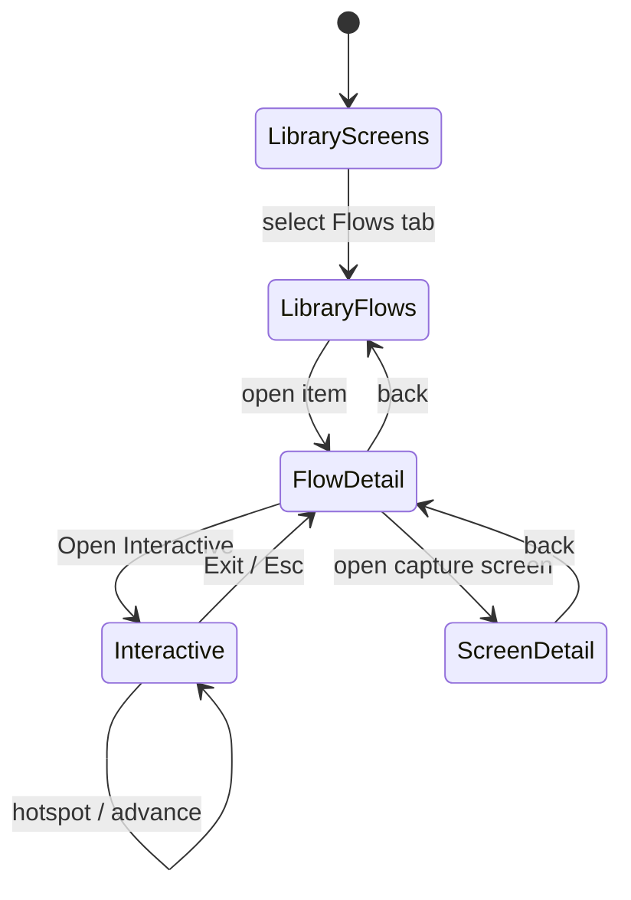

# DIG-011 Flows UI — wireframes & states

**Spec:** [`docs/DIG-011-flows-ui.md`](../docs/DIG-011-flows-ui.md)  
**Updated:** 2026-08-16 · Runtime UI in `apps/web` (Screens / Sections / Flows + Interactive)

## Library mode switch

Sticky magazine **Contents** nav (`MagazineContentsNav`): Screens · Devices · Sections · Flows. Compacts while scrolling (CHECKION scan/GEO pattern).

```text
┌──────────────────────────────────────────────┐
│ CONTENTS                                     │
│ 01 Screens   02 Devices   03 Sections  04 …  │
│                                              │
│  Flows                                       │
│  Multi-screen design journeys from captures  │
│                                              │
│  Action [Logging in ▾]   Search [……]  Clear  │
│                                              │
│  ┌────────────────────────────────────────┐  │
│  │ Sign in from home                      │  │
│  │ logging_in · 2 screens · 1 edge        │  │
│  └────────────────────────────────────────┘  │
│  ┌────────────────────────────────────────┐  │
│  │ Cart to confirmation                   │  │
│  │ checkout · 3 screens · 2 edges         │  │
│  └────────────────────────────────────────┘  │
└──────────────────────────────────────────────┘
```

## Flow detail

```text
┌──────────────────────────────────────────────┐
│ Sign in from home          [Open Interactive]│
│ chips: Logging in                            │
│ app_fixture_shop                             │
├─────────────────┬────────────────────────────┤
│ Screens         │ Transitions                │
│ 0 home   ●      │ home → login               │
│ 1 login         │ href_join · hotspot yes    │
└─────────────────┴────────────────────────────┘
```

## Interactive Mode (login)

```text
┌──────────────────────────────────────────────┐
│ Sign in from home     1 / 2           [Exit] │
├──────────────────────────────────────────────┤
│                                              │
│   [========= home screenshot =========]      │
│                    ┌──────────┐              │
│                    │ Sign in  │ ← hotspot    │
│                    └──────────┘              │
│                                              │
├──────────────────────────────────────────────┤
│ → login                                      │
└──────────────────────────────────────────────┘
```

## Interactive Mode (onboarding branch)

```text
┌──────────────────────────────────────────────┐
│ First-run onboarding   1 / 4          [Exit] │
├──────────────────────────────────────────────┤
│   [=========== welcome ===========]          │
│      ┌─────┐              ┌──────┐           │
│      │Tips │              │ Skip │           │
│      └─────┘              └──────┘           │
│   (require explicit choice — no auto-advance)│
└──────────────────────────────────────────────┘
```

## Client state machine



## Copy rules

- “Flows” = DIG-011 only  
- Screen detail keeps “Page narrative” / existing page_flow list — never “User flow”  
- Empty Flows: honest about needing multi-screen index; mention fixtures for dev  

## Fixture map for UI mocks

| UI view | Fixture |
|---------|---------|
| List | `fixtures/flows/api/flows.list.json` |
| Detail | `fixtures/flows/api/login-href-join.detail.json` |
| Interactive linear | `fixtures/flows/api/login-href-join.interactive.json` |
| Interactive branch | `fixtures/flows/api/onboarding-branch.interactive.json` |
